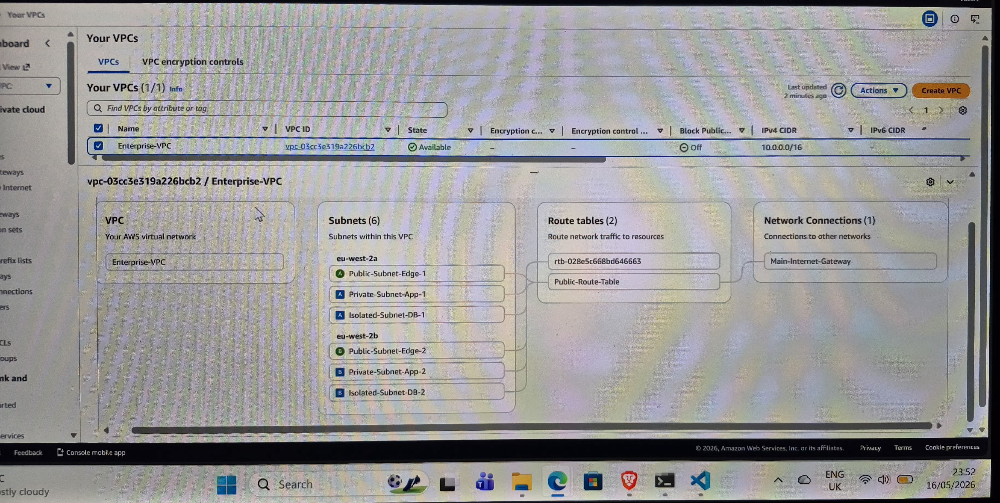

# AWS Multi-AZ 3-Tier Network Architecture Automation

## 📌 Project Overview
This project automates the provisioning of a secure, production-ready, highly available 3-tier network hub inside the **AWS London Region (eu-west-2)** using Terraform. 

By utilizing Infrastructure as Code (IaC), this configuration replaces manual web-console click-ops with an isolated network footprint capable of hosting modern, high-security enterprise web applications.

---

## 🗺️ Network Topology Visualized
Below is the live, verified resource map generated directly by AWS inside the London region from this Terraform blueprint:



---

## 🛠️ Architectural Breakdown & Technical Notes

### 1. High Availability (Multi-AZ)
The entire infrastructure is dynamically mapped across two distinct physical Availability Zones: **`eu-west-2a`** and **`eu-west-2b`**. If an entire AWS data center experiences a physical outage, the infrastructure seamlessly continues executing in the secondary zone.

### 2. Tier Segmentation & Isolation
The network implements a strict boundary layout, carving out 6 dedicated subnets inside a `10.0.0.0/16` CIDR block:
* **Public Web Edge (2x Subnets):** Houses entry-point components (like Application Load Balancers or NAT Gateways). These are the only subnets directly connected to the outside world.
* **Private Application Tier (2x Subnets):** Completely isolated from the internet. This layer houses the backend microservices, compute instances, and application logic.
* **Isolated Database Tier (2x Subnets):** Locked down at the deepest layer of the cloud network. Houses database systems, completely shielded from external vectors.

### 3. Traffic Routing Rules
* **Internet Gateway (IGW):** Acts as the front door for your network, binding the custom VPC to the public internet.
* **Public Route Tables:** Explicitly associated with the public subnets, mapping default traffic (`0.0.0.0/0`) out to the Internet Gateway.
* **Main Route Table:** Acts as an implicit firewall, ensuring that any unassociated subnet defaults to local internal routing only—preventing data leaks.

---

## 💻 The Infrastructure Code

### 1. Network Blueprint Configuration (`terraform/main.tf`)
```hcl
terraform {
  required_providers {
    aws = {
      source  = "hashicorp/aws"
      version = "~> 5.0"
    }
  }
}

provider "aws" {
  region = var.aws_region
}

# Create the Core Virtual Private Cloud
resource "aws_vpc" "enterprise_vpc" {
  cidr_block           = var.vpc_cidr
  enable_dns_hostnames = true
  enable_dns_support   = true

  tags = {
    Name = "Enterprise-VPC"
  }
}

# Create the Internet Gateway for public traffic
resource "aws_internet_gateway" "igw" {
  vpc_id = aws_vpc.enterprise_vpc.id

  tags = {
    Name = "Main-Internet-Gateway"
  }
}

# Dynamically Provision Public Subnets
resource "aws_subnet" "public" {
  count                   = length(var.public_subnet_cidrs)
  vpc_id                  = aws_vpc.enterprise_vpc.id
  cidr_block              = var.public_subnet_cidrs[count.index]
  availability_zone       = var.availability_zones[count.index]
  map_public_ip_on_launch = true

  tags = {
    Name = "Public-Subnet-Edge-${count.index + 1}"
  }
}

# Dynamically Provision Private App Subnets
resource "aws_subnet" "private_app" {
  count             = length(var.private_app_cidrs)
  vpc_id            = aws_vpc.enterprise_vpc.id
  cidr_block        = var.private_app_cidrs[count.index]
  availability_zone = var.availability_zones[count.index]

  tags = {
    Name = "Private-Subnet-App-${count.index + 1}"
  }
}

# Dynamically Provision Isolated DB Subnets
resource "aws_subnet" "private_db" {
  count             = length(var.private_db_cidrs)
  vpc_id            = aws_vpc.enterprise_vpc.id
  cidr_block        = var.private_db_cidrs[count.index]
  availability_zone = var.availability_zones[count.index]

  tags = {
    Name = "Isolated-Subnet-DB-${count.index + 1}"
  }
}

# Public Route Table configuration
resource "aws_route_table" "public_rt" {
  vpc_id = aws_vpc.enterprise_vpc.id

  route {
    cidr_block = "0.0.0.0/0"
    gateway_id = aws_internet_gateway.igw.id
  }

  tags = {
    Name = "Public-Route-Table"
  }
}

# Explicitly link Public Subnets to Public Routing
resource "aws_route_table_association" "public" {
  count          = length(var.public_subnet_cidrs)
  subnet_id      = aws_subnet.public[count.index].id
  route_table_id = aws_route_table.public_rt.id
}

2. terraform/variables.tf

variable "aws_region" {
  type        = string
  default     = "eu-west-2"
  description = "Target deployment region (London)"
}

variable "vpc_cidr" {
  type        = string
  default     = "10.0.0.0/16"
  description = "Primary IP CIDR Block for the VPC"
}

variable "availability_zones" {
  type    = list(string)
  default = ["eu-west-2a", "eu-west-2b"]
}

variable "public_subnet_cidrs" {
  type    = list(string)
  default = ["10.0.1.0/24", "10.0.2.0/24"]
}

variable "private_app_cidrs" {
  type    = list(string)
  default = ["10.0.11.0/24", "10.0.12.0/24"]
}

variable "private_db_cidrs" {
  type    = list(string)
  default = ["10.0.21.0/24", "10.0.22.0/24"]
}

3. Output Blueprints / terraform/outputs.tf

output "vpc_id" {
  value       = aws_vpc.enterprise_vpc.id
  description = "The unique tracking ID of the live VPC"
}

output "public_subnet_ids" {
  value = aws_subnet.public[*].id
}

output "private_subnet_ids" {
  value = [for s in aws_subnet.private_app : s.id]
}

🚀 Deployment & Lifecycle Demonstration

Environment Verification

aws configure
# Target Region: eu-west-2
# Output Format: json


Infrastructure Lifecycle Execution

1. Initialize Directory

terraform init

2.Review Execution Blueprint

terraform plan

3. Live Provisioning

terraform apply --auto-approve

4. Pragmatic Teardown: Safely erases all live architecture resources within seconds to achieve cost optimization ($0.00 spend state).

terraform destroy --auto-approve


